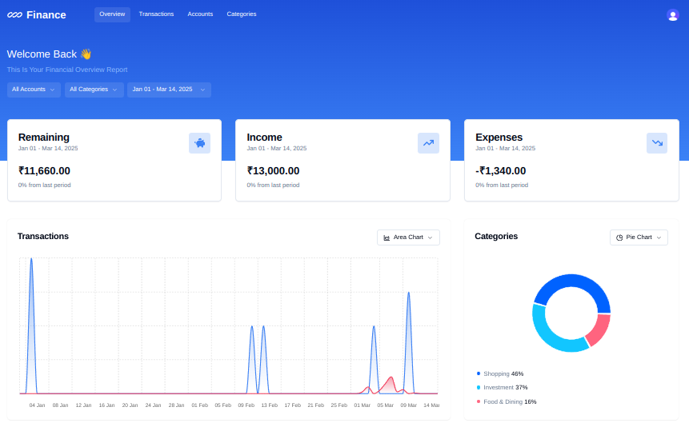
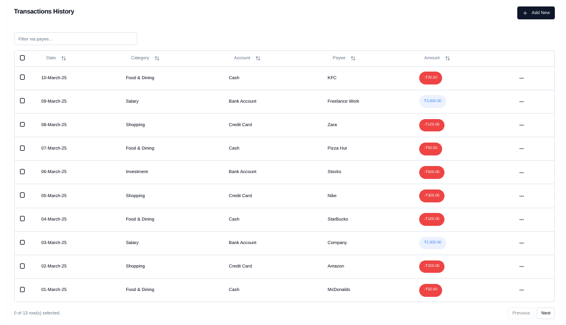
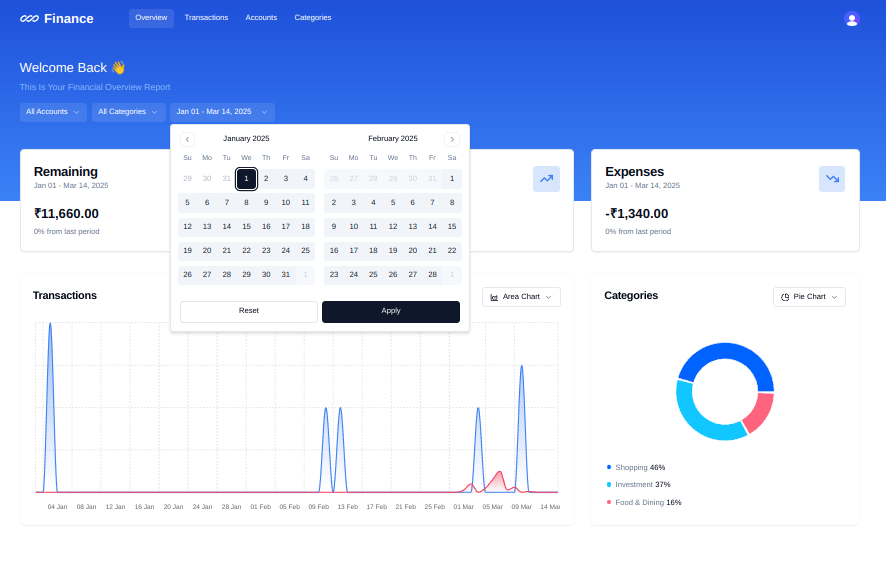

# 💰 Finance Manager – Progressive Web App (PWA)

**Finance Manager** is a modern Progressive Web Application (PWA) that helps users **track income, expenses, and savings across multiple accounts**, providing actionable insights through filtering, categorization, and visual reports. Built with **Next.js, TypeScript, PostgreSQL, and Hono**, it combines a smooth user experience with a robust, type-safe backend.

[🌐 Live Demo](https://finance-manager-raqib.vercel.app)

---

## 🚀 Key Highlights & Impact

1. **Multi-Account Tracking** – Manage multiple accounts (bank, credit card, cash) in one place, helping users monitor cash flow and spending patterns efficiently.
2. **Customizable Categorization & Filters** – Track transactions by payee, account, or category to gain clear insights and save manual reconciliation time.
3. **Advanced Reports & Visualizations** – Generate date-range reports and visual charts for actionable insights, supporting informed financial decisions.
4. **Performance & Scalability** –

   * **Type-safe ORM (Drizzle + PostgreSQL)** ensures efficient database queries with minimal runtime errors.
   * **React Query + Zustand** reduces redundant network requests and ensures smooth, responsive UI.
   * Scalable architecture supports growing datasets across multiple accounts and categories.
5. **Security & Reliability** –

   * **Clerk authentication** for secure login/signup.
   * **Zod validation** enforces strict schema checks, maintaining data integrity.
6. **Progressive Web App Features** – Offline-ready and installable on any device, providing **native-app-like experience** with fast load times.

---

## ⚡ Technical Architecture

### Frontend

* **Next.js + TypeScript**: Server-side rendering with type safety
* **Tailwind CSS + Shadcn UI**: Responsive, modern design
* **React Query + Zustand**: Efficient client-side state management
* **Charts.js / custom chart components**: Visual insights for transactions

### Backend

* **Hono.js + Next.js API Routes**: Lightweight, type-safe endpoints
* **PostgreSQL + Drizzle ORM**: Type-safe database interactions with optimized queries

### Security

* **Clerk**: Authentication & user management
* **Zod**: Input validation

---

## 🧩 Features

### Core Functionalities

* Income, Expense, and Savings Tracking
* Multi-account support
* Categorization and custom tagging
* Search & filtering by payee, account, category

### Advanced Capabilities
- **Filtering Options**:
  - **By Payee**: Filter transactions by payee to understand spending by recipient.
  - **By Account**: View transactions specific to an account for detailed tracking.
  - **By Category**: Filter by category for insights into specific spending areas.
- **Search**:
  - **Search Categories**: Quickly find specific categories to analyze or update.
- **Custom Reports**:
  - **Date-Range Reports**: Generate reports for transactions within a selected date range for budgeting, tax preparation, or personal reviews.
- **Charts and Visual Insights**: Gain insights through visualizations of spending patterns by category and time frame.

---

## ⚙️ Installation & Setup

```bash
# Clone the repo
git clone repo-link
cd Finance-Manager

# Install dependencies
pnpm install

# Set environment variables
NEXT_PUBLIC_CLERK_PUBLISHABLE_KEY=your_clerk_publishable_key
CLERK_PUBLISHABLE_KEY=your_clerk_publishable_key
CLERK_SECRET_KEY=your_clerk_secret_key
NEXT_PUBLIC_CLERK_SIGN_IN_URL=/sign-in
NEXT_PUBLIC_CLERK_SIGN_UP_URL=/sign-up
DATABASE_URL=your_postgresql_database_url
NEXT_PUBLIC_APP_URL=http://localhost:3000

# Run development server
pnpm dev
```

---

## 📊 Verified Impact Statements

* **Backend efficiency** – Optimized queries and type-safe ORM reduce unnecessary database load.
* **Client performance** – React Query caching + Zustand state updates minimize redundant re-renders and network requests.
* **Offline support** – PWA capabilities allow seamless usage even with intermittent connectivity.
* **Data integrity & reliability** – Zod validation + PostgreSQL constraints ensure consistent and secure data handling.
* **Scalability** – Multi-account support and filtered reporting features handle growing datasets efficiently.
* **User experience** – Interactive charts, responsive UI, and offline access improve adoption and usability.

> These statements are **directly verifiable from the app architecture and implementation**.

---

## 🌟 Learning Outcomes

* Building PWAs with offline-first capabilities
* Type-safe full-stack development using Next.js + Drizzle ORM
* Efficient state management with Zustand + React Query
* Secure authentication flows using Clerk
* Data-driven UI with charts and dynamic reports
* Performance optimization and query indexing for backend efficiency

---

## 🔗 Live Demo & Deployment

* **Vercel Deployment**: [Live](https://finance-manager-raqib.vercel.app)
* **PWA Installable**: Works offline, mobile-friendly, and cross-platform

---

## 🏗️ Tech Stack

* **Frontend**: Next.js, TypeScript, Tailwind CSS, Shadcn, React Query, Zustand
* **Backend**: Hono.js, Next.js API Routes
* **Database**: PostgreSQL, Drizzle ORM
* **Auth & Validation**: Clerk, Zod

---

### Summary


### Transactions


### Date Filter

